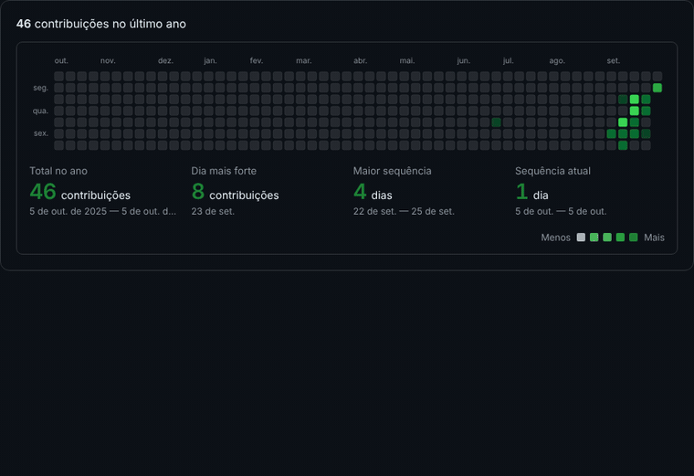

Marabá – PA, Brasil

---

### Sobre mim

- Trabalho com **controladoria, análise de dados e automação**
- Crio relatórios e indicadores no **Power BI** e automações com **Power Automate**
- Desenvolvo sites e sistemas pela **[CARVEX](https://carvex-one.vercel.app)** — *Technology, refined.*

### Tecnologias

  

  
  
  
  

### Estatísticas

  
  

  

### Meu ano em 3D

  

### Projetos

| Projeto | O que faz |
|---|---|
| [**CARVEX**](https://carvex-one.vercel.app) | Site oficial da CARVEX — landing pages, BI e automação |
| [**Retirar Fundo de Imagem**](https://clearfundo.vercel.app) | Remove o fundo de imagens direto no navegador |
| [**Limpador de Metadados**](https://metadados-flax.vercel.app) | Apaga os metadados de fotos antes de compartilhar |
| [**Revolution Conference**](https://revolution-conference.vercel.app) | Landing page de evento |

---

  

